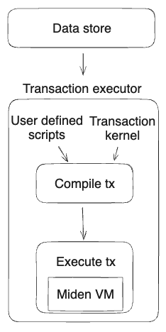

# Transactions overview

## Architecture overview

The Miden transaction architecture comprises a set of components that interact with each other. This section of the documentation discusses each component.

The diagram shows the components responsible for Miden transactions and how they fit together. 

!!! tip "Key to diagram"
    - The [transaction executor](execution.md) prepares, executes, and proves transactions. 
    - The executor compiles the [transaction kernel](kernel.md) plus user-defined notes and transaction scripts into a single executable program for the Miden VM.
    - Users write scripts using [kernel procedures](procedures.md) and [contexts](contexts.md).

## Miden transactions

Transactions in Miden facilitate single account state changes. Miden requires two transactions to transfer assets between accounts.

A transaction takes a single account and some [notes](../notes.md) as input, and outputs the same account with a new state, together with some other notes.

Miden aims for the following:

- Parallel transaction execution: Because a transaction is always performed against a single account, Miden obtains asynchronicity. 
- Private transaction execution: Because every transaction emits a state-change with a STARK proof, there is privacy when the transaction executes locally.

There are two types of transactions in Miden: local transactions and network transactions.

## Transaction design

Transactions describe the state-transition of a single account that takes chain data and `0 to 1023` notes as input and produces a `TransactionWitness` and `0 to 4096` notes as output.

{ width="75%" }

At its core, a transaction is an executable program - the transaction kernel program - that processes the provided inputs and creates the requested outputs. Because the program is executed by the Miden VM, a STARK-proof is generated for every transaction.

## Asset transfer using two transactions

Transferring assets between accounts requires two transactions as shown in the diagram below.

The first transaction invokes a function on `account_a` (e.g. a `send_asset` function) which creates a new note and also updates the internal state of `account_a`. The second transaction consumes the note which invokes a function on `account_b` (e.g. a `receive_asset` function) which updates the internal state of `account_b`.

### Asynchronous execution

Both transactions can be executed asynchronously: first `transaction1` is executed, and then, some time later, `transaction2` is executed. 

This opens up a few interesting possibilities:

* Owner of `account_b` may wait until they receive many notes and process them all in a single transaction.
* A note script may include a clause which allows the source account to consume the note after some time. Thus, if `account_b` does not consume the note after the specified time, the funds can be returned. This mechanism could be used to make sure funds sent to non-existent accounts are not lost.
* Neither sender nor the recipient need to know who the other side is. From the sender's perspective they just need to create `note1` (and for this they need to know the assets to be transferred and the root of the note's script). They don't need any information on who will eventually consume the note. From the recipient's perspective, they just need to consume `note1`. They don't need to know who created it.
* Both transactions can be executed "locally". For example, we could generate a zk-proof that `transaction1` was executed and submit it to the network. The network can verify the proof without the need for executing the transaction itself. The same can be done for `transaction2`. Moreover, we can mix and match. For example, `transaction1` can be executed locally, but `transaction2` can be executed on the network, or vice-versa.

## Local and network transactions

### Local transactions

This is where clients executing the transactions also generate the proofs of their correct execution. So, no additional work needs to be performed by the network. 

Local transactions are useful for several reasons:

1. They are cheaper (i.e. lower fees) as zk-proofs are already generated by the clients.
2. They allow fairly complex computations because the proof size doesn't grow linearly with the complexity of the computation.
3. They enable privacy as neither the account state nor account code are needed to verify the zk-proof.

### Network transactions

This is where the operator executes the transaction and generates the proofs. 

Network transactions are useful for two reasons:

1. Clients may not have sufficient resources to generate zk-proofs.
2. Executing many transactions against the same public account by different clients is challenging, as the account state changes after every transaction. Due to this, the Miden node/operator acts as a "synchronizer" to execute transactions sequentially by feeding the output of the previous transaction into the input of the next.

 