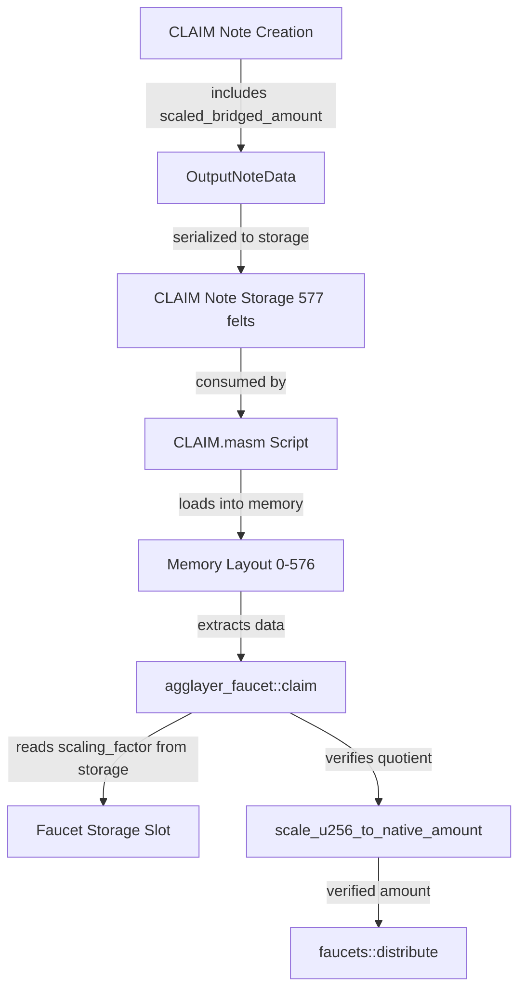

# Implementation Plan: Add Quotient Amount to CLAIM Note Inputs

## Overview

This plan details the implementation of adding a `scaled_bridged_amount` field to CLAIM note inputs. This field represents the quotient (y) from the division `x / 10^scale_exp`, where the verification logic is already implemented in [`asset_conversion.masm::scale_u256_to_native_amount`](../crates/miden-agglayer/asm/bridge/asset_conversion.masm:140).

## Background

When scaling a U256 bit integer into a Felt amount, we need to perform division with verification. The procedure [`scale_u256_to_native_amount`](../crates/miden-agglayer/asm/bridge/asset_conversion.masm:140) verifies that `c = a / b` by checking:
- `scale = 10^scale_exp`
- `prod = y * scale`
- `rem = x - prod` (must not underflow)
- `rem < scale` (remainder bound)

Currently, the scaling logic is stubbed out in [`agglayer_faucet.masm::build_p2id_output_note`](../crates/miden-agglayer/asm/bridge/agglayer_faucet.masm:198). This implementation will integrate the actual scaling verification.

## Architecture Changes

### Data Flow



### Storage Layout Changes

#### Current CLAIM Note Storage (576 felts)
- Proof Data: [0..535] - 536 felts
- Leaf Data: [536..567] - 32 felts
- Output Note Data: [568..575] - 8 felts
  - P2ID serial num: [568..571] - 4 felts
  - Target faucet ID: [572..573] - 2 felts
  - Output note tag: [574] - 1 felt
  - Padding: [575] - 1 felt

#### New CLAIM Note Storage (577 felts)
- Proof Data: [0..535] - 536 felts
- Leaf Data: [536..567] - 32 felts
- Output Note Data: [568..576] - 9 felts
  - P2ID serial num: [568..571] - 4 felts
  - Target faucet ID: [572..573] - 2 felts
  - Output note tag: [574] - 1 felt
  - **scaled_bridged_amount: [575] - 1 felt** ← NEW
  - Padding: [576] - 1 felt

#### New Agglayer Faucet Storage Slot

A new storage slot will be added to store origin token configuration:

**Slot Name**: `"miden::agglayer::origin_token"`

**Layout** (Word - 4 felts):
- `[0]`: origin_token_address[0] (u32)
- `[1]`: origin_token_address[1] (u32)
- `[2]`: origin_token_address[2] (u32)
- `[3]`: origin_token_address[3] (u32)

**Additional Word** (if needed for 5 felts + scaling factor):
- `[0]`: origin_token_address[4] (u32)
- `[1]`: scaling_factor (u8, range 0-18)
- `[2]`: padding
- `[3]`: padding

**Note**: We'll use a Map storage slot to support multiple origin tokens, indexed by origin token address hash.

## Implementation Steps

### 1. Update Rust Structures

#### File: [`crates/miden-agglayer/src/claim_note.rs`](../crates/miden-agglayer/src/claim_note.rs:184)

**Changes to `OutputNoteData` struct:**

```rust
pub struct OutputNoteData {
    /// P2ID note serial number (4 felts as Word)
    pub output_p2id_serial_num: Word,
    /// Target agg faucet account ID (2 felts: prefix and suffix)
    pub target_faucet_account_id: AccountId,
    /// P2ID output note tag
    pub output_note_tag: NoteTag,
    /// Scaled bridged amount (quotient from U256 / 10^scale_exp)
    pub scaled_bridged_amount: Felt,  // ← NEW FIELD
}
```

**Changes to `OutputNoteData::to_elements()`:**

```rust
pub fn to_elements(&self) -> Vec<Felt> {
    const OUTPUT_NOTE_DATA_ELEMENT_COUNT: usize = 9; // Changed from 8 to 9
    let mut elements = Vec::with_capacity(OUTPUT_NOTE_DATA_ELEMENT_COUNT);

    // P2ID note serial number (4 felts as Word)
    elements.extend(self.output_p2id_serial_num);

    // Target faucet account ID (2 felts: prefix and suffix)
    elements.push(self.target_faucet_account_id.prefix().as_felt());
    elements.push(self.target_faucet_account_id.suffix());

    // Output note tag
    elements.push(Felt::new(self.output_note_tag.as_u32() as u64));

    // Scaled bridged amount (NEW)
    elements.push(self.scaled_bridged_amount);

    // Padding
    elements.extend(vec![Felt::ZERO; 1]);

    elements
}
```

**Changes to `ClaimNoteStorage::try_from()`:**

```rust
fn try_from(storage: ClaimNoteStorage) -> Result<Self, Self::Error> {
    // proof_data + leaf_data + output_note_data
    // 536 + 32 + 9 = 577 (changed from 576)
    let mut claim_storage = Vec::with_capacity(577);

    claim_storage.extend(storage.proof_data.to_elements());
    claim_storage.extend(storage.leaf_data.to_elements());
    claim_storage.extend(storage.output_note_data.to_elements());

    NoteStorage::new(claim_storage)
}
```

### 2. Update CLAIM Note Script

#### File: [`crates/miden-agglayer/asm/note_scripts/CLAIM.masm`](../crates/miden-agglayer/asm/note_scripts/CLAIM.masm:1)

**Update constants:**

```masm
const PROOF_DATA_SIZE = 536
const LEAF_DATA_SIZE = 32
const OUTPUT_NOTE_SIZE = 9  # Changed from 8 to 9

const PROOF_DATA_START_PTR = 0
const LEAF_DATA_START_PTR = 536
const OUTPUT_NOTE_DATA_START_PTR = 568
```

**Update memory layout documentation (lines 150-167):**

```masm
#! NoteStorage layout (577 felts total):  # Changed from 576
#! - smtProofLocalExitRoot      [0..255]  : 256 felts
#! - smtProofRollupExitRoot     [256..511]: 256 felts
#! - globalIndex                [512..519]: 8 felts
#! - mainnetExitRoot            [520..527]: 8 felts
#! - rollupExitRoot             [528..535]: 8 felts
#! - leafType                   [536]     : 1 felt
#! - padding                    [537..539]: 3 felts
#! - originNetwork              [540]     : 1 felt
#! - originTokenAddress         [541..545]: 5 felts
#! - destinationNetwork         [546]     : 1 felt
#! - destinationAddress         [547..551]: 5 felts
#! - amount                     [552..559]: 8 felts
#! - metadata                   [560..567]: 8 felts
#! - output_p2id_serial_num     [568..571]: 4 felts
#! - target_faucet_account_id   [572..573]: 2 felts
#! - output_note_tag            [574]     : 1 felt
#! - scaled_bridged_amount      [575]     : 1 felt  ← NEW
#! - padding                    [576]     : 1 felt  # Changed from [575]
```

**Update parameter documentation (lines 169-191):**

Add after `output_note_tag`:
```masm
#! - scaled_bridged_amount: Scaled bridged amount (quotient from amount / 10^scale_exp)
```

**Update `write_claim_data_into_advice_map_by_key` comments (lines 82-87):**

```masm
#! OUTPUT_NOTE_DATA_KEY => [
#!   output_p2id_serial_num[4],       // P2ID note serial number (4 felts, Word)
#!   target_faucet_account_id[2],     // Target faucet account ID (2 felts, prefix and suffix)
#!   output_note_tag[1],              // P2ID output note tag
#!   scaled_bridged_amount[1],        // Scaled bridged amount (quotient) ← NEW
#!   padding[1],                      // padding (1 felt)
#! ]
```

### 3. Update Agglayer Faucet MASM

#### File: [`crates/miden-agglayer/asm/bridge/agglayer_faucet.masm`](../crates/miden-agglayer/asm/bridge/agglayer_faucet.masm:1)

**Add new constants:**

```masm
# The slot in this component's storage layout where the bridge account ID is stored.
const BRIDGE_ID_SLOT = word("miden::agglayer::faucet")

# The slot where origin token address and scaling factor are stored
const ORIGIN_TOKEN_SLOT = word("miden::agglayer::origin_token")

const PROOF_DATA_WORD_LEN = 134
const LEAF_DATA_WORD_LEN = 8
const OUTPUT_NOTE_DATA_WORD_LEN = 3  # Changed from 2 to 3 (9 felts / 4 = 2.25, rounded up)
```

**Update memory address constants:**

```masm
const OUTPUT_NOTE_SCALED_AMOUNT_MEM_ADDR = 575  # NEW
```

**Add new procedure to read origin token configuration:**

```masm
#! Reads the origin token address and scaling factor from storage.
#!
#! Inputs:  []
#! Outputs: [origin_token_addr[5], scaling_factor]
#!
#! Invocation: exec
proc get_origin_token_config
    push.ORIGIN_TOKEN_SLOT[0..2]
    # => [origin_token_idx]

    # Get origin token configuration from storage
    exec.active_account::get_item
    # => [word[0], word[1], word[2], word[3]]
    
    # Extract scaling factor (stored in word[1] upper bits or separate location)
    # This will depend on final storage layout decision
    # For now, assume: word[0..3] = origin_token_addr[0..3]
    # Need second word for origin_token_addr[4] and scaling_factor
    
    # TODO: Implement based on final storage layout
end
```

**Update `build_p2id_output_note` procedure:**

Replace the stubbed scaling logic:

```masm
proc build_p2id_output_note
    # ... existing code ...

    exec.get_raw_claim_amount
    # => [AMOUNT[1], AMOUNT[0], tag, note_type, RECIPIENT]

    # Get scaling factor from storage
    exec.get_origin_token_config
    # => [origin_token_addr[5], scaling_factor, AMOUNT[1], AMOUNT[0], tag, note_type, RECIPIENT]
    
    # We only need scaling_factor, drop origin_token_addr
    swap.5 drop swap.5 drop swap.5 drop swap.5 drop swap.5 drop
    # => [scaling_factor, AMOUNT[1], AMOUNT[0], tag, note_type, RECIPIENT]

    # Load the pre-computed scaled amount from memory
    mem_load.OUTPUT_NOTE_SCALED_AMOUNT_MEM_ADDR
    # => [scaled_amount, scaling_factor, AMOUNT[1], AMOUNT[0], tag, note_type, RECIPIENT]

    # Verify the scaling using scale_u256_to_native_amount
    # Stack needs to be: [x0, x1, x2, x3, x4, x5, x6, x7, scale_exp, y]
    # We have: [y, scale_exp, AMOUNT[1], AMOUNT[0], ...]
    
    # Rearrange stack to match scale_u256_to_native_amount input format
    movup.3 movup.3 movup.3 movup.3  # Move AMOUNT[0] up
    movup.3 movup.3 movup.3 movup.3  # Move AMOUNT[1] up
    # => [AMOUNT[1], AMOUNT[0], y, scale_exp, tag, note_type, RECIPIENT]
    
    # Reverse to get little-endian order
    exec.word::reverse swapw exec.word::reverse
    # => [x0, x1, x2, x3, x4, x5, x6, x7, y, scale_exp, tag, note_type, RECIPIENT]
    
    # Move scale_exp and y to correct positions
    movup.9 movup.9
    # => [x0, x1, x2, x3, x4, x5, x6, x7, scale_exp, y, tag, note_type, RECIPIENT]

    # Call verification procedure
    exec.asset_conversion::scale_u256_to_native_amount
    # => [y, tag, note_type, RECIPIENT]

    exec.faucets::distribute
    # => [pad(16)]
end
```

**Update `claim` procedure comments (lines 220-240):**

```masm
#!   OUTPUT_NOTE_DATA_KEY => [
#!     output_p2id_serial_num[4],       // P2ID note serial number (4 felts, Word)
#!     agglayer_faucet_account_id[2],   // Agglayer faucet account ID (2 felts, prefix and suffix)
#!     output_note_tag[1],              // P2ID output note tag
#!     scaled_bridged_amount[1],        // Scaled bridged amount (quotient) ← NEW
#!     padding[1],                      // padding (1 felt)
#!   ]
```

### 4. Update Rust Account Creation Functions

#### File: [`crates/miden-agglayer/src/lib.rs`](../crates/miden-agglayer/src/lib.rs:225)

**Update `create_agglayer_faucet_component` signature:**

```rust
pub fn create_agglayer_faucet_component(
    token_symbol: &str,
    decimals: u8,
    max_supply: Felt,
    bridge_account_id: AccountId,
    origin_token_address: EthAddressFormat,  // NEW
    scaling_factor: u8,                       // NEW (0-18)
) -> AccountComponent {
    // Create network faucet metadata slot
    let token_symbol = TokenSymbol::new(token_symbol).expect("Token symbol should be valid");
    let metadata_word =
        Word::new([max_supply, Felt::from(decimals), token_symbol.into(), FieldElement::ZERO]);
    let metadata_slot =
        StorageSlot::with_value(NetworkFungibleFaucet::metadata_slot().clone(), metadata_word);

    // Create agglayer-specific bridge storage slot
    let bridge_account_id_word = Word::new([
        Felt::new(0),
        Felt::new(0),
        bridge_account_id.suffix(),
        bridge_account_id.prefix().as_felt(),
    ]);
    let agglayer_storage_slot_name = StorageSlotName::new("miden::agglayer::faucet")
        .expect("Agglayer faucet storage slot name should be valid");
    let bridge_slot = StorageSlot::with_value(agglayer_storage_slot_name, bridge_account_id_word);

    // Create origin token configuration slot (NEW)
    let origin_token_elements = origin_token_address.to_elements();
    let origin_token_word1 = Word::new([
        origin_token_elements[0],
        origin_token_elements[1],
        origin_token_elements[2],
        origin_token_elements[3],
    ]);
    let origin_token_word2 = Word::new([
        origin_token_elements[4],
        Felt::from(scaling_factor),
        Felt::ZERO,
        Felt::ZERO,
    ]);
    
    let origin_token_slot_name = StorageSlotName::new("miden::agglayer::origin_token")
        .expect("Origin token storage slot name should be valid");
    
    // Store as map with two entries or as two separate values
    // For simplicity, we'll use a value slot with the first word
    // and store the second word separately or use a map
    let origin_token_slot = StorageSlot::with_value(origin_token_slot_name, origin_token_word1);
    
    // TODO: Decide on storage strategy for 6 felts (5 address + 1 scaling factor)

    // Combine all storage slots
    let agglayer_storage_slots = vec![metadata_slot, bridge_slot, origin_token_slot];
    agglayer_faucet_component(agglayer_storage_slots)
}
```

**Update all related functions:**
- [`create_agglayer_faucet_builder`](../crates/miden-agglayer/src/lib.rs:284)
- [`create_agglayer_faucet`](../crates/miden-agglayer/src/lib.rs:303)
- [`create_existing_agglayer_faucet`](../crates/miden-agglayer/src/lib.rs:320)

### 5. Update Tests

All test files that create CLAIM notes need to be updated to provide the `scaled_bridged_amount` field:

#### Files to Update:
- [`crates/miden-testing/tests/agglayer/bridge_in.rs`](../crates/miden-testing/tests/agglayer/bridge_in.rs)
- Any other test files that create `OutputNoteData` or `ClaimNoteStorage`

**Example change:**

```rust
let output_note_data = OutputNoteData {
    output_p2id_serial_num: serial_num,
    target_faucet_account_id: faucet_id,
    output_note_tag: note_tag,
    scaled_bridged_amount: Felt::new(100_000_000), // NEW: Add computed quotient
};
```

The `scaled_bridged_amount` should be computed using:
```rust
use miden_agglayer::EthAmount;

let eth_amount = EthAmount::from_u256(amount_u256);
let scaled_amount = eth_amount.scale_to_felt_deterministic(scaling_factor)?;
```

## Verification Checklist

- [ ] All memory addresses are consistent across MASM files
- [ ] Storage size calculations are correct (576 → 577 felts)
- [ ] OUTPUT_NOTE_SIZE constant updated (8 → 9)
- [ ] OUTPUT_NOTE_DATA_WORD_LEN updated appropriately
- [ ] All comments reflect the new field
- [ ] Rust struct has new field with proper documentation
- [ ] `to_elements()` includes new field in correct position
- [ ] Storage slot for origin token address and scaling factor is properly defined
- [ ] MASM procedures read from new storage slot correctly
- [ ] Scaling verification is properly integrated (not stubbed)
- [ ] All tests compile and pass
- [ ] No breaking changes to existing functionality

## Testing Strategy

1. **Unit Tests**: Test `OutputNoteData::to_elements()` returns 9 felts
2. **Integration Tests**: Test CLAIM note creation with scaled amount
3. **MASM Tests**: Test `scale_u256_to_native_amount` verification in context
4. **End-to-End Tests**: Test full claim flow with scaling verification

## Potential Issues & Mitigations

### Issue 1: Storage Slot Size
**Problem**: Origin token address (5 felts) + scaling factor (1 felt) = 6 felts, but Word is 4 felts.

**Solution**: Use a Map storage slot or two separate value slots:
- Option A: Map indexed by origin token address hash → scaling factor
- Option B: Two slots: one for origin token address, one for scaling factor
- Option C: Store in a single map entry with custom serialization

**Recommendation**: Use Option B (two separate slots) for simplicity.

### Issue 2: Memory Layout Shifts
**Problem**: Adding 1 felt shifts all subsequent memory addresses.

**Mitigation**: Only padding is affected (moves from [575] to [576]). No other fields shift because the new field is inserted before padding.

### Issue 3: Backward Compatibility
**Problem**: Existing CLAIM notes won't have the new field.

**Mitigation**: This is a breaking change. All existing CLAIM notes must be recreated or a migration strategy implemented.

## Implementation Order

1. Update Rust structures ([`claim_note.rs`](../crates/miden-agglayer/src/claim_note.rs))
2. Update CLAIM note script ([`CLAIM.masm`](../crates/miden-agglayer/asm/note_scripts/CLAIM.masm))
3. Update agglayer faucet MASM ([`agglayer_faucet.masm`](../crates/miden-agglayer/asm/bridge/agglayer_faucet.masm))
4. Update account creation functions ([`lib.rs`](../crates/miden-agglayer/src/lib.rs))
5. Update tests
6. Verify and validate

## Success Criteria

- [ ] CLAIM notes include `scaled_bridged_amount` field
- [ ] Agglayer faucet reads origin token address and scaling factor from storage
- [ ] `scale_u256_to_native_amount` is called (not stubbed) during claim processing
- [ ] All tests pass
- [ ] Documentation is complete and accurate
- [ ] No regressions in existing functionality
